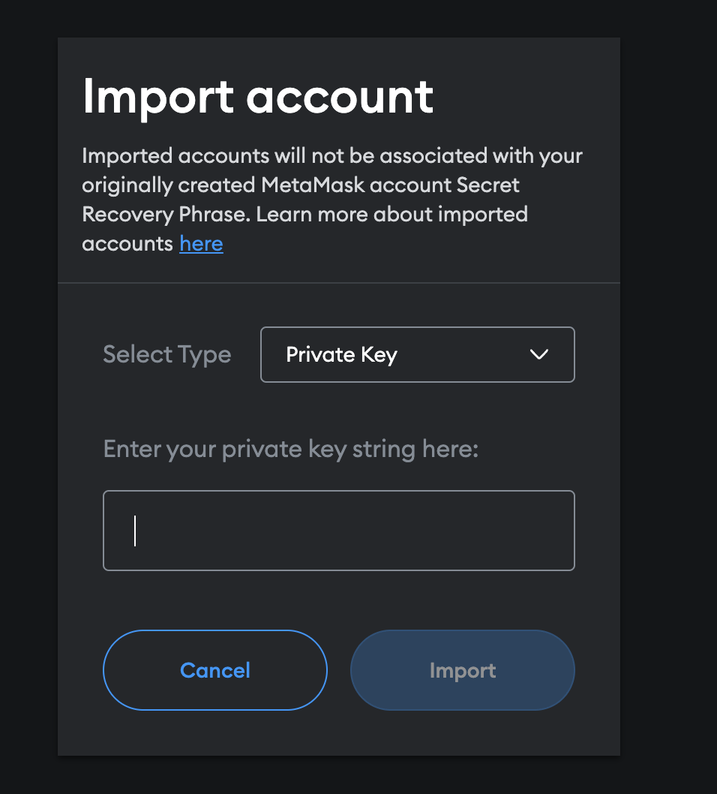

# NFT Pets

In this project we create NFT pets out of DALL-E generated pixel art images with functionality to chat with them via ChatGPT and buy/sell them on an Ethereum marketplace.

---

### Project Goals 

1. Build ERC721 tokens and create 
2. Leverage OpenAI APIs to integrate AI tools into a blockchain app
3. Combine the blockchain backend and Python Streamlit frontend to create full-stack dApp

---

### Project Outline

1. Create a Solidity smart contract to create ERC721 tokens
    * Add functionality to buy and sell tokens between Ethereum addresses
    * Implement “middleman” to take 2% cut of every transaction
2. Use DALL-E API to generate unique pixel art NFT pets
3. Use ChatGPT API to create chat interactions between NFT pets
4. Put all of these elements together in a Streamlit UI with Metamask, Ganache, and Web3.py

---

### Summary

In the Streamlit UI the user can interact with the Solidity smart contract functions to register, chat with, and buy NFT pets. After logging in with an Ethereum address connected through Ganache and MetaMask, you can register a new NFT pet that will be uniquely generated using the DALL-E image generator to create pixel art animals.


With the ChatGPT API integrated in the app, the user can go to the chat tab and interact with each of their owned pets. The conversation will be maintained and built on as you talk with your pet, and will only reset if you decide to chat with another pet. The API also, somewhat, allows us to give a "personality" to the chatbot so ours is set to "NFT pet". This doesn't drastically change the responses you get compared to a normal ChatGPT conversation, but it will every now in then mention that it is supposed to act as an NFT pet. 


You can then see your entire collection of minted NFTs: 


You can also go to the marketplace tab and see all of the NFT pets that have been listed by the accounts on the blockchain. Assuming your logged in account has enough funds to purchase the pet, you can buy the pet and transfer ownership from the previous owner to yourself. You will then be able to chat with and view the pet on your account. 


---

## Technologies

This is a Python 3.8 project that uses the following dependencies:

1. [Streamlit](https://streamlit.io/) (1.2.0) - Web app interface
2. [Ganache](https://trufflesuite.com/ganache/) (2.7.0) - Ethereum blockchain
3. [Solidity](https://soliditylang.org/) (0.8.19) - Language for smart contract
4. [Remix](https://remix-project.org/) - IDE for Web3 developement
5. [OpenAI](https://platform.openai.com/docs/api-reference) (0.27.2) - DALL-E and ChatGPT integration
6. [MetaMask](https://MetaMask.io/) (10.28.1) - Blockchain Wallet

---

## Installation

This project is ran using a [conda dev environment](https://www.anaconda.com/products/distribution). 

Assuming you have Python installed you should be able to install the required dependencies using the following commands: 

```
pip install web3==5.17
pip install streamlit
pip install openai
pip install python-dotenv
```

However, if you have conda set up you can directly copy the environment that we used to create this project with [requirements.txt](./Resources/requirements.txt):

Create a copy of the conda dev environment with `conda create --name myenv --file ./Resources/requirements.txt`

Then install the requirements with `conda install --name myenv --file ./Resources/requirements.txt`

---

## Usage
To run our app, you will need to create a local blockchain using Ganache and deploy the [pet_token.sol](./Smart_Contracts/pet_token.sol) smart contract on [Remix](https://remix.ethereum.org/) using an injected [MetaMask](https://metamask.io/) provider.

1. Open Ganache and create a quickstart Ethereum workspace. 

    

2. Using the MetaMask browser extension, setup a network how "devNetwork" is setup with the RPC url as HTTP://127.0.0.1:7545 and Chain ID as 1337. 

    

3. Click on the account bubble in the top right of MetaMask to open the dropdown and use the "Import Account" button to create accounts. This will open a form to input a private key of an account, you can use this form to enter in the private keys of however many accounts you want from your newly created Ganache blockchain. You can grab the private key of an account by clicking the key icon at the far right of each account listed in your Ganache workspace. 

    

    

    

4. Go to [remix.ethereum.org](https://remix.ethereum.org/) and upload the provided [pet_token.sol](./Smart_Contracts/pet_token.sol) smart contract in the "File Explorer" section. You should be able to view the full code as a Solidity smart contract.

    

5. Compile the pet_token.sol file in Remix under the "Solidity compiler" section using the 0.5.5+commit.47a71e8f compiler. 

    

6. Go to the "Deploy and run transactions" seciont of Remix to deploy the "PetToken - pet_token.sol" contract. You can leave the gas limit as the default but make sure to select the correct contract to deploy. Assuming you have correctly set up your accounts in MetaMask, when you use the "Environment" dropdown in Remix you will see an option that says "Injected Provider - MetaMask". Clicking this option will open up a MetaMask Notification window where you can select all of the accounts you imported. Select which accounts you wish to use and click the next button, there will then be another screen where you can click the connect button to successfully connect your Ganache accounts. 

    

7. Click the "Deploy" button in the remix UI and another Metamask notification should pop up where you can press the confirm button to deploy the pet_token.sol smart contract with the selected ganache account under the "Account" field in the Remix UI. You will notice in Ganache that the selected account will now have less Ethereum because it paid for the gas to deploy the contract. In remix, you will see "PETTOKEN at ..." under the "Deployed Contracts" section of the "Deploy and run transactions" tab. 

    

    

8. Hover over the deployed PETTOKEN contract in the "Deployed Contracts" section to copy the contract address. 

    

9. Clone the nft-pets repo from GitHub using `git clone https://github.com/fintech-quagga-group/nft-pets.git`

10. In your local clone of nft-pets, create a .env file and add two lines like so:

    ```
    WEB3_PROVIDER_URI = 'HTTP://127.0.0.1:7545'
    SMART_CONTRACT_ADDRESS = ''
    ```

    You can then put in the copied contract address from step 8 in the quotes for SMART_CONTRACT_ADDRESS

11. Go to [https://platform.openai.com/overview](https://platform.openai.com/overview) and create an OpenAI account to access their API. 

12. Once you are logged in, click on your account icon and use the "View API Keys" button on the dropdown list to access the [API keys page](https://platform.openai.com/account/api-keys). You can then use the "Create new secret key" button to get your OpenAI API key.

    

    

13. Add the line `OPENAI_API_KEY = ''` to your .env file and fill in the quotes with the API key you generated in the previous step. Your final .env file should now look like: 

    ```
    WEB3_PROVIDER_URI = 'HTTP://127.0.0.1:7545'
    SMART_CONTRACT_ADDRESS = ''
    OPENAI_API_KEY = ''
    ```

14. With Ganache open on your newly created workspace, your smart contract deployed on Remix, and your .env file setup with your secret keys, you are ready to run the app. In VSCode or your terminal you can run the app using the command `streamlit run app.py`

---

### Other Files 


---

## Contributors

[Ethan Silvas](https://github.com/ethansilvas) <br>
[Naomy Velasco](https://github.com/naomynaomy) <br>
[Karim Bouzina](https://github.com/karim985) <br>
[Jeff Crabill](https://github.com/jeffreycrabill) <br>

---

## License

This project uses the [GNU General Public License](https://choosealicense.com/licenses/gpl-3.0/)